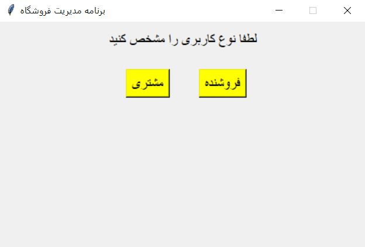
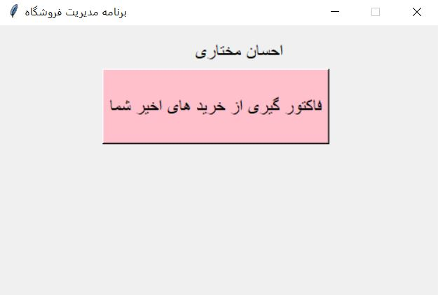
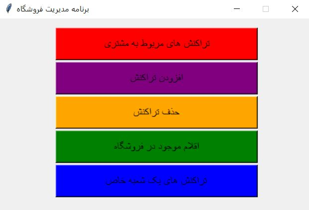
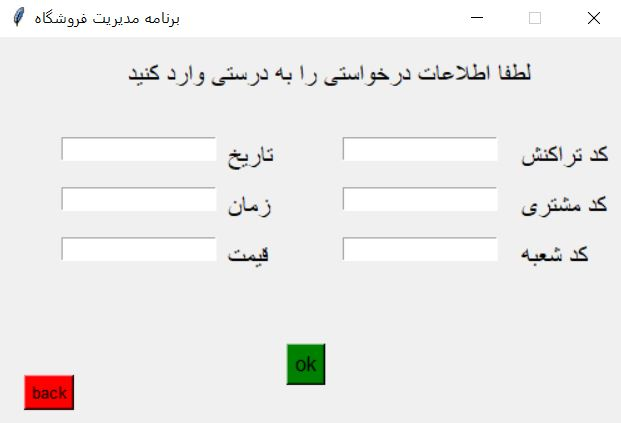

# simpleShopManager-persian
```diff
+ Simple Shop Maneger SoftWare
```
Simple project for managing your shop stuffs, transactions and ...<br />
A simple shop manager in Persian language in both "client" and "manager" mode!<br />
The UI is made up with tkinter.<br />
In client mode, with your client Id you can see your transactions and buys.<br />
In manager mode with your Id and your pass code, you can see client transactions,add and remove transactions,
stuffs in shop,other branch trancactions.<br />
You can see two files,"shopManager-UIonly" that only contains UI without database codes and "shopManager-complete" with database code connections.<br />
The "help" is for UI documents(in persian).<br />
The "code doc" is for both codes(in persian).<br />
The important thing is i didnt add my own database here, you have to design your own database based on the database codes in "shopManager-complete".<br />




